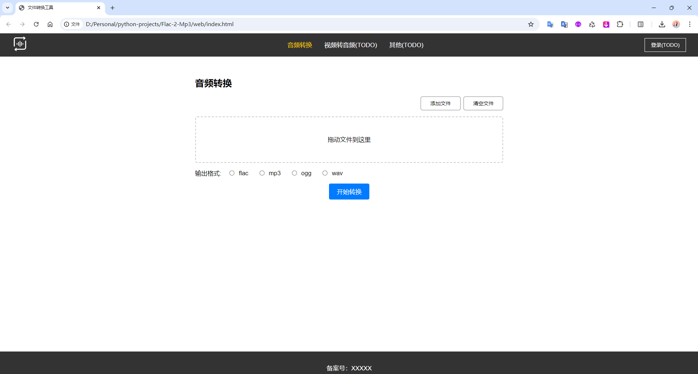
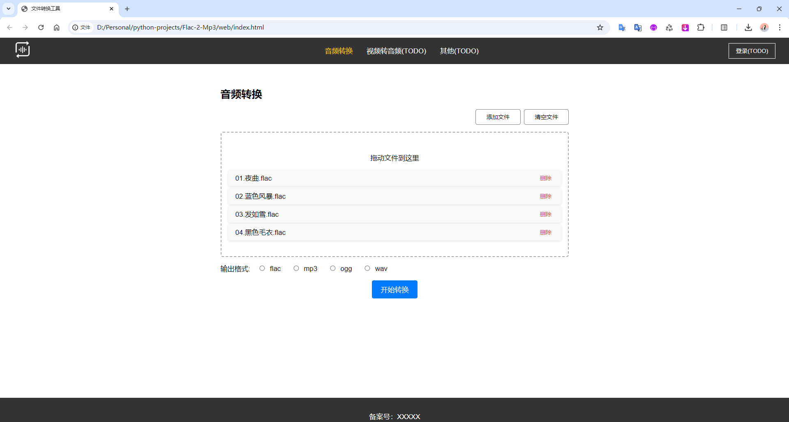
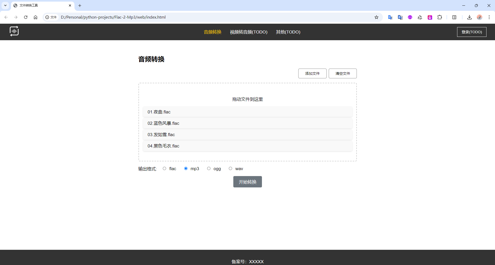
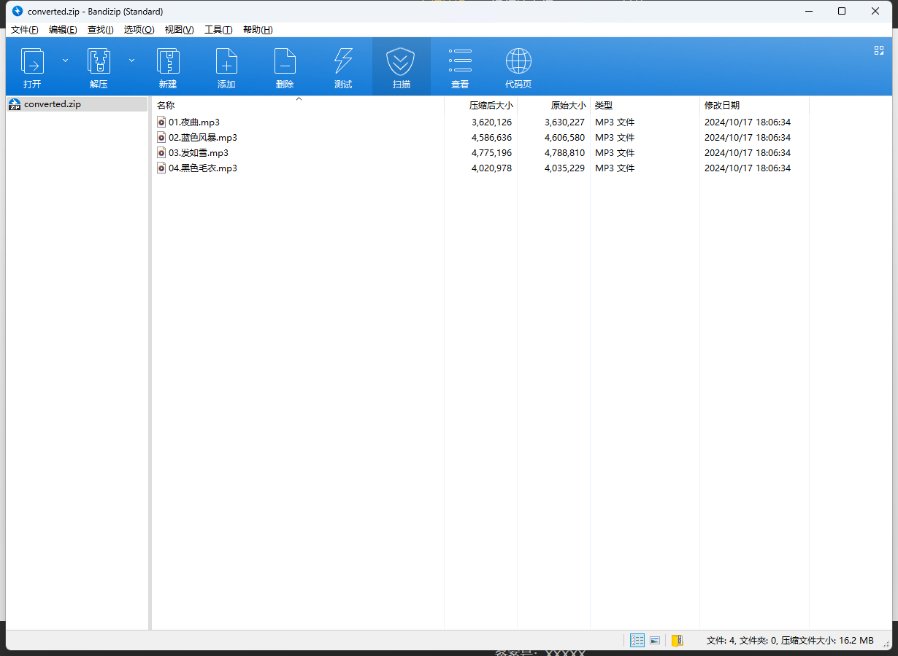

# audio-convert

## 项目简介

`audio-convert` 是一个基于 Python、ffmpeg、HTML、CSS 和 JavaScript 的音频格式互转工具。该项目提供了一个简洁、美观的前端WEB界面，用户可以轻松上传音频文件并选择目标格式进行转换，最终生成转换后的文件并提供下载。此工具适用于多种常见的音频格式，旨在为用户提供方便快捷的音频格式转换体验。

## 功能特点
- 支持多种音频格式之间的互相转换，如 MP3、WAV、AAC、FLAC 等。
- 前端界面简洁美观，用户体验流畅。
- 支持批量上传音频文件并批量转换。
- 支持文件压缩后打包下载。
- 文件上传与转换过程简单直观，只需几步操作。
- 后端基于 Python、ffmpeg，实现文件的处理和转换，前端使用 HTML+CSS+JavaScript 。

## 技术栈
- **前端**：HTML、CSS、JavaScript
- **后端**：Python（v3.11.9）、Flask框架
- **音频转换**：基于 FFmpeg 实现音频文件的格式转换

## 项目结构

- web（前端代码文件）
  - css
    - styles.css（css样式文件）
  - js
    - scripts.js（js文件）
  - index.html（web页面首页）
  - audio-convert.svg（logo文件）
- .gitignore（git忽略文件）
- app.py（API接口文件）
- application.py（自定义配置文件）
- convert.py（音频格式转换文件）
- func.py（公共方法文件）
- log_config.py（日志配置文件）
- run.py（运行文件）
- requirements.txt（安装库文件）
- assets（存储图片文件夹）
- README.md（自述文件）


## 使用说明

### 1. 克隆项目

首先，将项目克隆到本地：

```bash
git clone https://github.com/OnlyAPI/audio-convert.git
cd audio-convert
```

### 2. 创建虚拟环境并激活

```bash
python -m venv .venv

windows激活虚拟环境：.\.venv\Scripts\activate
Mac激活虚拟环境：source .venv/bin/activate
```

### 3. 安装依赖

确保你的环境中已经安装了 Python 和 `pip`。在虚拟环境中运行以下命令安装项目所需依赖：

```shell
pip install -r requirements.txt
```

### 4. 安装 FFmpeg

音频格式转换依赖于 `FFmpeg`，请确保你已经在本地安装了它。可以通过以下命令检查是否安装成功：

```
ffmpeg -version
```

如果尚未安装，请根据你的操作系统参考 [FFmpeg 官网](https://ffmpeg.org/download.html) 进行安装。

### 5. 修改application.py文件（可选）

> 自定义设置存储路径、ffmpeg程序的安装位置、上传文件的大小和数量的控制、支持转换的音频格式等。

### 6. 运行项目

依赖安装完成后，使用以下命令启动 Flask 服务：

```
python run.py
```

### 7. 打开前端页面

> 直接打开web文件夹下的index.html文件


##  项目截图 

- 首页

  


- 上传文件

  


- 开始转换

  


- 转换成功会自动下载压缩包

  


## TODO

- 视频转音频
- 其他
- 登录


## 鸣谢

- 感谢 [iconfont](https://www.iconfont.cn/search/index?searchType=icon&q=%E9%9F%B3%E9%A2%91%E8%BD%AC%E6%8D%A2) 提供的svg图像
- 感谢 [ffmpeg](https://ffmpeg.org/) 提供的格式转换技术
- 本项目前端代码大部分为AI生成，感谢 [通义千问](https://tongyi.aliyun.com/qianwen/) 、[ChatGPT](https://chatgpt.com/)。


## 问题

1. 测试过程中flac文件转 mp3、flac、wav、ogg格式可以转换成功，但是转 aac、 alac 、 m4a 、 wma 格式时均报错，报错大致内容为：

   ```
   [aist#0:0/pcm_s16le @ 000002ba392c2e40] Guessed Channel Layout: stereo
   Input #0, wav, from 'C:\Users\yifan\AppData\Local\Temp\tmp_t56duw0':
     Duration: 00:03:46.83, bitrate: 1411 kb/s
     Stream #0:0: Audio: pcm_s16le ([1][0][0][0] / 0x0001), 44100 Hz, stereo, s16, 1411 kb/s
   [AVFormatContext @ 000002ba39037780] Requested output format 'wma' is not known.
   ```

   

